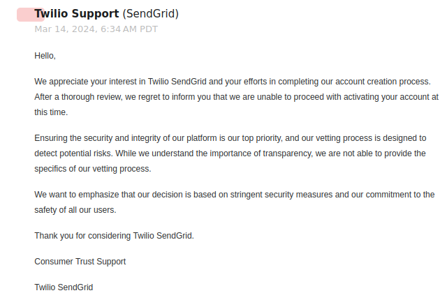
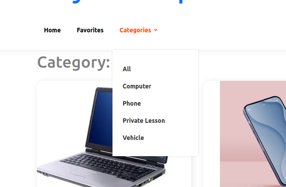
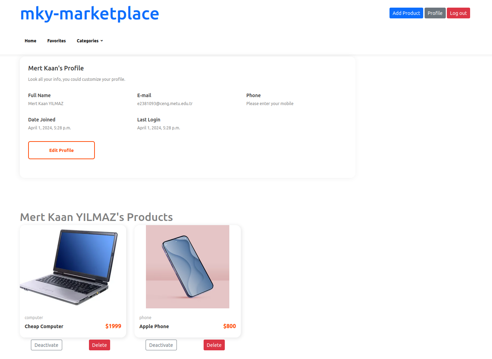
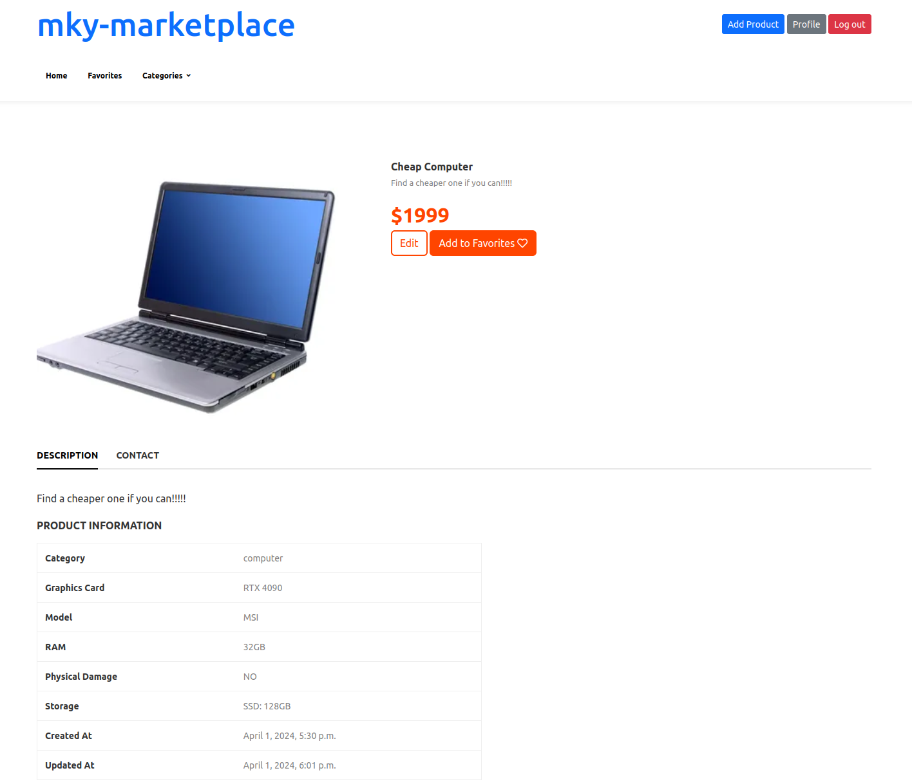
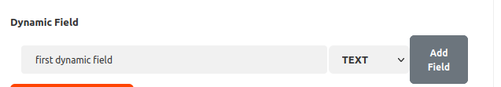
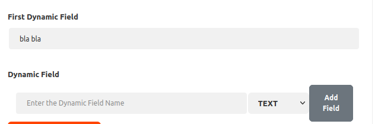
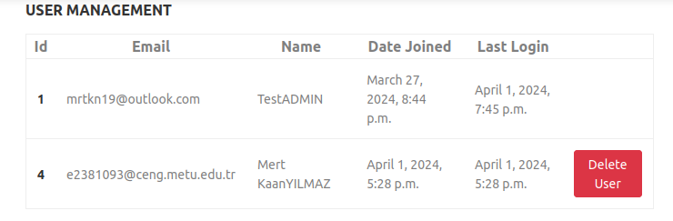
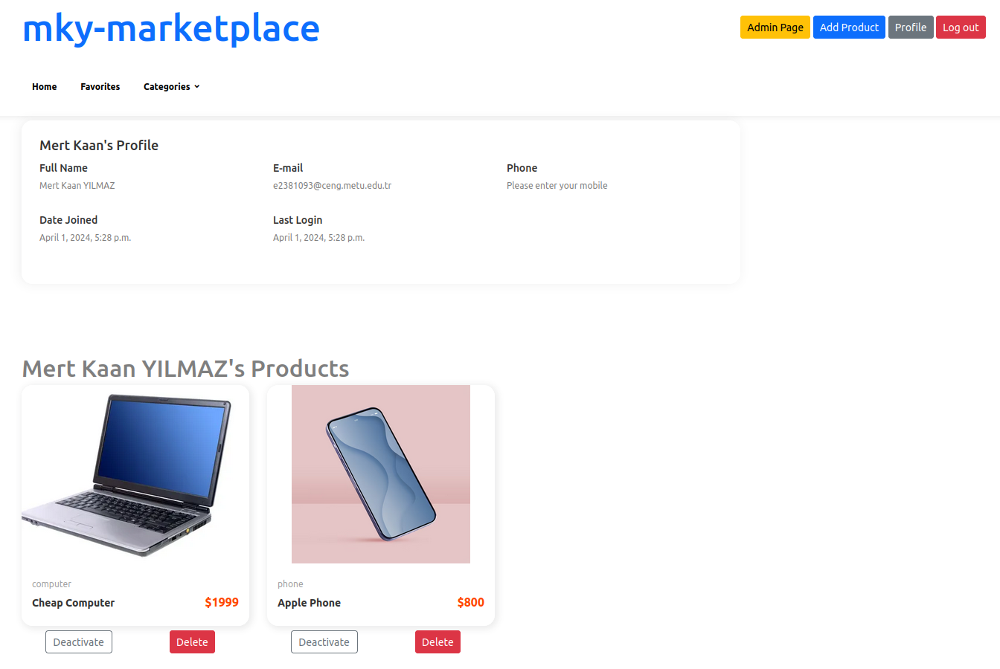

# mky-marketplace

## Overview

*URL of Render Deployment:* https://mky-marketplace.onrender.com/

*User credentials:*

*Admin:* [ email: mrtkn19@outlook.com password: mert2345 ]

*A Regular User:*" [ email: e2381093@ceng.metu.edu.tr password: mert2345 ]

This project is created specifically for CENG495 | HW-I. Main purpose of the project is to have a grasp on NoSQL (MongoDB) and features related to it.

## SETUP (If you want to run the project locally)

Download the source code.

`git clone https://github.com/holynekk/ceng-marketplace.git`

Create a new python virtual environment.

`python3 -m venv venv`

Activate the newly created virtual environment.

`source venv/bin/activate`

Download required python packages.

`pip install -r requirements.txt`

Run the project.

`./manage.py runserver`

*IMPORTANT NOTE:* You have to set DEBUG variable to True in the settings.py.

# Implementation Details

## Why python/django?

I have started my project with Java/SpringBoot at first. After some time, I realized that handling dynamic data with spring
will cause some problems in the future according to my research. Therefore, I have rewritten all the code in python/django
that I have written already.

There is no real reason for me to choose java over python at first. I just feel more comfortable with it, but it was clear
that use cases with mongoDB were so much easier with python/django. So that's why I have switched over.

## Why there is no email verification?

This step was very problematic for me. At first, SendGrid did not work. It kept sending me this email and did not let me
activate my account:

This was the first problem. As our TA said, I found just another email service provider.

Secondly, there were some problems with django/djongo/Django-Verify-Email packages. Since Django-Verify-Email did not
work well with mongodb (more specifically djongo package), I could not configure my email sender in this project. But
I want to give you some details how would I implement email verification if everything did go well.

Normally, django auth_user object has a field named is_active. This field is used to check if users email has been verified
or not. After a user creates and account, `send_verification_email(request, form)` function needs to be called from 
`from verify_email.email_handler import send_verification_email` package. It's that simple. Meanwhile, user should not be able
to log in until email is verified. All the email template, verification token and other stuff is handled by django. There is
nothing more to do.

It is really simple, but I could not properly implement it just because of those issues I have mentioned. I hope you consider
this while grading and using the application.

## MONGODB Usage?

There are four main collections (products, favorites, categories, auth_user) to handle logic throughout the whole application (
Other collections comes from django migrations that are automatically generated).

Products collection stores all the product data dynamically. Every product has some required fields (title, description, price,
imageLink, category). Other than these fields, every field is stored dynamically. If you omit a field when creating or updating a
product, it will be deleted. Some of the product fields handled with custom features as in the recitation video (Computer storage
is stored as dict, private lessons' lesson field is stored as list, and phones' camera specifications are stored as dynamic objects).

Favorites collection includes user_id product_id pairs to store users' favorite items all in one collection.

Categories collection includes different category objects that stores category key/name and category specific variables with their keys and types.

Auth_user collection includes user data that is managed by django.

## Login Instructions

As I have mentioned in "Why there is no email verification?" part, there is no email verification for obvious reasons. You can just
register and then login to use the application. I have also provided 2 users credentials (1 admin 1 regular user) at the top of this
file. You can use the application by using those credentials.

## General User Guide

Here I'll describe how the general features of the application works.

There is a navigation just under the header. You can use this menu to go to home page, see favorites, and filter all
products by their categories by using the dropdown menu. 

You can reach your profile information by clicking the profile button in the top-right corner. Here, you can view your
own products, delete or activate/deactivate them, and update your profile information by clicking edit profile button.

Whenever you click on a product, it will bring you its own product details page. Here, you can see product and contact
information at the bottom by clicking the tabs. You can also edit product if you own it, or add/remove it into/from
your favorites list. (Contact information will not be visible if you are not logged in.)

if you want to add a dynamic field while adding or editing a product, you can use this part in the bottom part of the form.
After you click add field, another input field will be added into your form according to its type (Text or Number).

If you are logged in as an admin user, you will see a button called admin page. It will take you to the user management page.
Here, you can view all users, and if you want, you can delete them (Whenever a user gets deleted, all of its data (products,
favorites) will be also deleted alongside the user data.).

Admins can also delete or activate/deactivate users item by using the buttons at the index page or that user's profile.

I would also like to implement Email functionality (4 pts) part, but as I said, my email provider application in django does not work.
It is also simple to send an email for that. Whenever there is an update, I should just check the previous price and the updated one to
decide if an email should be sent or not (favorites collection should be used here to get all users' ids).
